# SafeWallet Core

## 📋 Resumo Executivo (TL;DR)

SafeWallet Core é um **ecossistema de carteira digital completo**, englobando um microsserviço de backend de alta criticidade e uma interface web moderna. Desenvolvido para consolidar competências em **arquitetura Java avançada, React e ecossistemas Cloud-Native**. O sistema implementa um fluxo completo de gerenciamento de usuários, carteiras e transações com uma **esteira de segurança perimetral absoluta**, utilizando **Spring Security, Hashing BCrypt e tokens exclusivos Stateless JWT (JSON Web Tokens)**. O projeto adota validações rigorosas em camadas, tratamento elástico de exceções e frontend dinâmico construído com Next.js/React.

---

## 📚 Sumário de Conteúdo

1. [🎯 Problema](#-problema)
2. [✅ Solução e Diferenciais](#-solução-e-diferenciais)
3. [🏗️ Arquitetura do Sistema](#️-arquitetura-do-sistema)
4. [📸 Demonstração do Sistema (Documentário)](#-demonstração-do-sistema-documentário)
5. [🚀 Como Executar Localmente](#-como-executar-o-ecossistema-localmente)
6. [📝 Contratos Principais da API](#-contratos-principais-da-api-endpoints)
7. [☁️ Hospedagem e Infraestrutura AWS](#️-hospedagem-e-infraestrutura-aws-cloud-architecture)
8. [📄 Licença](#-licença)

---

## 🎯 Problema

Aplicações financeiras e carteiras digitais que gerenciam saldos sensíveis sofrem com vulnerabilidades críticas e gargalos de infraestrutura quando mal desenhadas:

- ❌ **Sessões Stateful pesadas**: Guardar sessões na memória RAM do servidor impede a escalabilidade horizontal e sobrecarrega a nuvem.
- ❌ **Vazamento de Senhas**: Armazenar credenciais em texto limpo ou com hashes fracos expõe os clientes a vazamentos catastróficos.
- ❌ **Falhas BOLA / IDOR**: Endpoints privados expostos sem filtros centralizados permitem que invasores interceptem requisições e manipulem dados de terceiros.
- ❌ **Vazamento de Metadados (Information Disclosure)**: Exceções internas e StackTraces não tratados expõem detalhes do banco de dados PostgreSQL para atacantes externos.

---

## ✅ Solução e Diferenciais

O ecossistema do SafeWallet Core resolve esses desafios através de padrões de arquitetura de mercado focados em máxima segurança:

1. **Segurança Profunda e Proteção de Rotas (Spring Security)**: O backend foi meticulosamente blindado utilizando o ecossistema Spring Security. Todas as rotas de transações e consultas financeiras são fechadas por padrão. Apenas os endpoints de registro e login são públicos. Isso garante que nenhum usuário anônimo ou mal-intencionado consiga sondar endpoints sensíveis ou realizar ataques BOLA (Broken Object Level Authorization).
2. **Eclusa Perimetral Stateless (JWT)**: A autenticação é totalmente baseada em JSON Web Tokens (RFC 7519). Ao realizar login, o servidor assina um passe digital usando o algoritmo HMAC256. A API prova a identidade a cada requisição sem precisar verificar o banco de dados para validar sessões, economizando memória RAM e permitindo escalabilidade instantânea.
3. **Interceptador Customizado (`OncePerRequestFilter`)**: Desenvolvemos um filtro customizado de rede (`SecurityFilter`) que atua como um leão de chácara. Ele intercepta 100% das requisições para rotas protegidas, limpa o cabeçalho `Authorization Bearer`, decifra o token, valida a assinatura e sua expiração, garantindo a integridade do contexto de segurança (`SecurityContextHolder`) de forma imutável antes que o fluxo alcance as regras de negócio.
4. **Trituração de Credenciais (BCrypt)**: Aplicação do algoritmo de hashing adaptativo e salting `BCryptPasswordEncoder` para garantir que senhas originais nunca toquem o banco de dados em texto plano.
5. **Tratamento Resiliente de Exceções Globais**: Uma central de atendimento de falhas (`GlobalExceptionHandler`) que captura desde erros de validação do Jakarta (`@Valid`) até quebras de regras de negócio (`RuntimeException`), blindando metadados e respondendo contratos limpos, evitando o vazamento de detalhes técnicos sensíveis do servidor.
6. **Fluxo de Transações ACID**: Operações de depósito, saque e transferência executadas dentro de transações que garantem consistência de dados e rollback automático em caso de falha.
7. **Interface Web Reativa e Segura**: Um frontend moderno construído com React e Next.js, garantindo experiência fluida e alinhado com o backend na interceptação de tokens expirados (401 Unauthorized), protegendo ativamente as rotas no lado do cliente.

---

## 🏗️ Arquitetura do Sistema

### Stack Tecnológico

| Camada | Tecnologia | Propósito |
|--------|-----------|-----------|
| **Backend Core** | Java 21, Spring Boot 4.0.6 | Motor core de execução do ecossistema |
| **Segurança** | Spring Security, Auth0 Java-JWT | Controle de eclusas e assinaturas criptográficas |
| **Criptografia** | BCrypt Ciphers | Hashing e salting de senhas em repouso |
| **Persistência** | Spring Data JPA, Hibernate | Mapeamento objeto-relacional e queries automatizadas |
| **Banco de Dados** | PostgreSQL 15 | Armazenamento relacional estável e ACID |
| **Frontend** | React 19, Next.js, Tailwind CSS | Interface rica, componentizada e responsiva |
| **Integração Front/Back**| Axios, Zustand | Gerenciamento de estado global e requisições HTTP |
| **Orquestração** | Docker, Docker Compose | Isolamento total de infraestrutura |

---

## 📸 Demonstração do Sistema (Documentário)

Acompanhe a jornada visual da utilização da plataforma **SafeWallet Core**, ilustrando desde a apresentação da landing page até operações financeiras seguras no sistema em execução.

### 1️⃣ Bem-vindo à SafeWallet
A nossa Landing Page principal apresenta as vantagens de ter uma carteira digital segura e moderna.

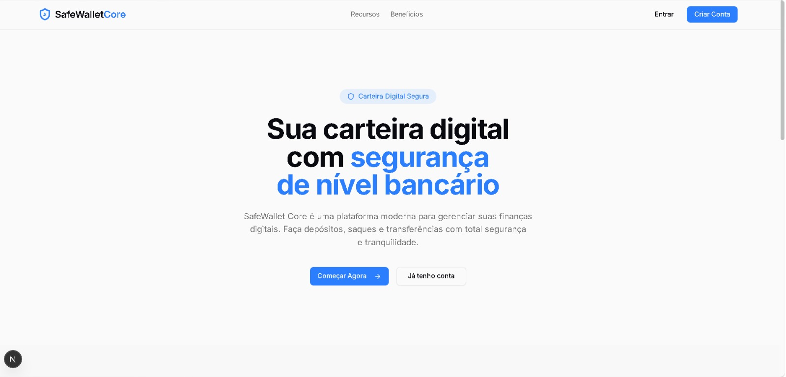

Continuando pela página, o usuário descobre mais detalhes sobre os recursos que garantem o ecossistema ACID das transações.

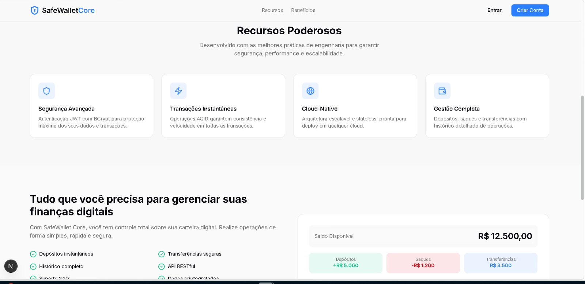

E finaliza com o rodapé institucional, garantindo a confiança do usuário.

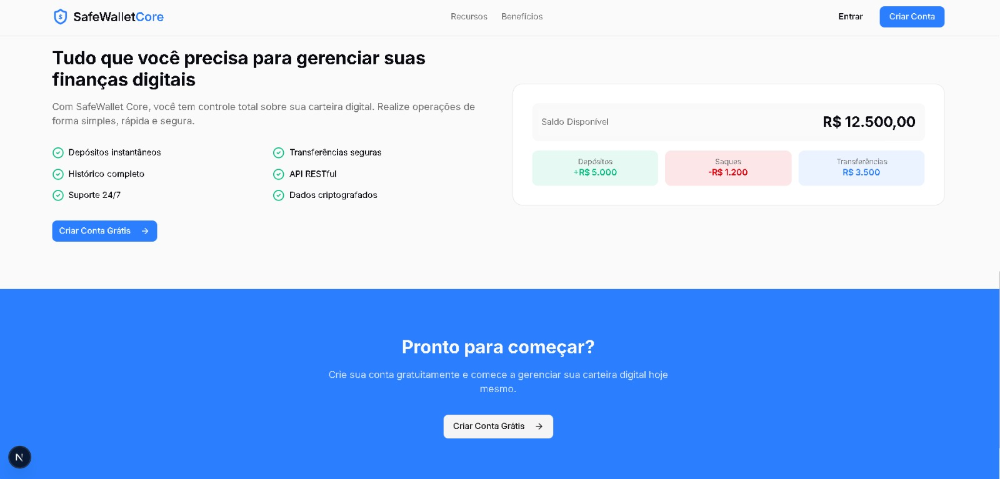

### 2️⃣ Entrando na Plataforma
O usuário acessa o portal de autenticação. Nos bastidores, ao validar as credenciais, o **Spring Security** emite um token **JWT (JSON Web Token)** assinado com HMAC256. O front-end em React armazena esse passe digital de forma segura, garantindo sessões *stateless* (sem estado na memória do servidor) e proteção total nas próximas requisições.

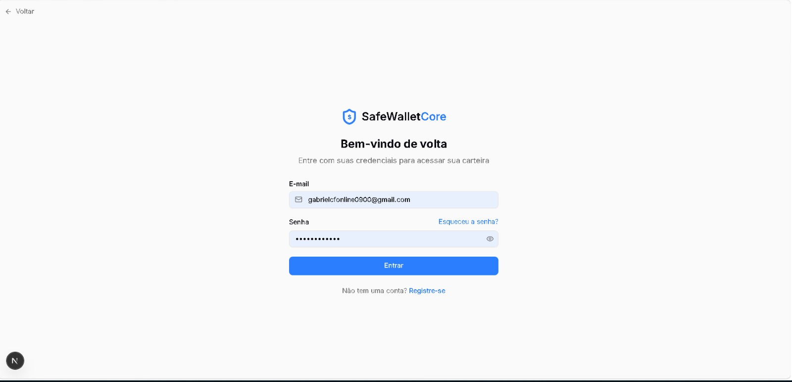

### 3️⃣ A Criação de Novos Usuários
Caso ainda não tenha uma conta, o sistema disponibiliza um formulário de cadastro validado e reativo. Ao submeter, a API aplica automaticamente o **hashing adaptativo BCrypt** na senha do usuário. A senha original nunca toca o banco de dados PostgreSQL, mitigando riscos de vazamentos catastróficos. O usuário 1 e o usuário 2 realizam seus cadastros sob essa proteção.

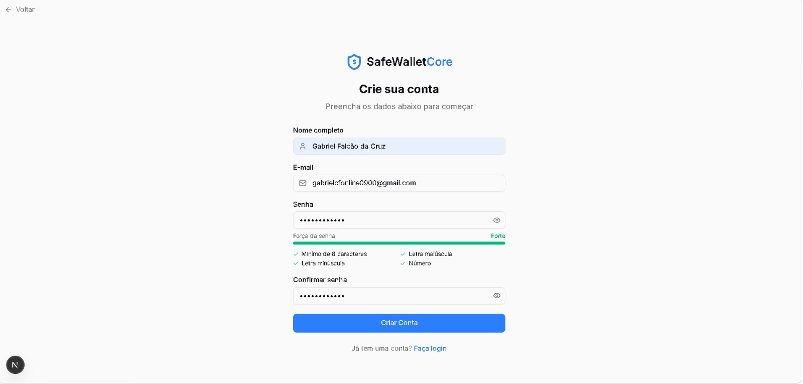

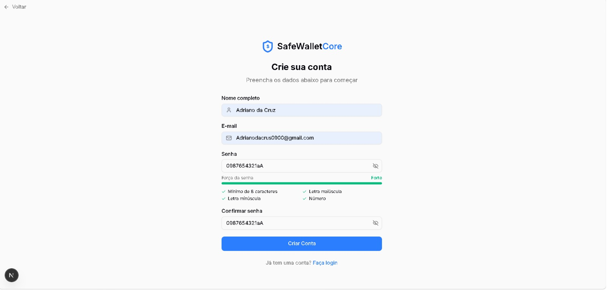

### 4️⃣ A Visão Geral: O Dashboard
Após entrar no sistema, o React envia o JWT no cabeçalho (Bearer Token). Nosso **SecurityFilter (`OncePerRequestFilter`)** intercepta a chamada, valida a assinatura criptográfica e autoriza o carregamento do Dashboard. Gráficos em tempo real mostram as estatísticas protegidas.

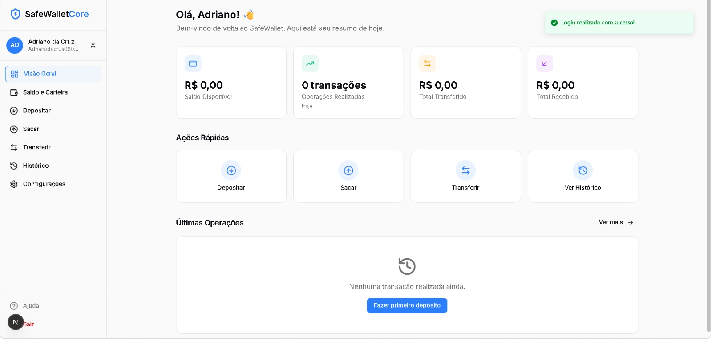

### 5️⃣ Gestão de Carteira e Saldo
Nesta área exclusiva, o usuário pode consultar a saúde da sua conta. Graças ao contexto extraído do token pelo **Spring Security**, o backend garante que não ocorram ataques BOLA/IDOR — o usuário só consegue visualizar e iterar com o seu próprio Wallet ID e saldo. O isolamento de contexto é absoluto.

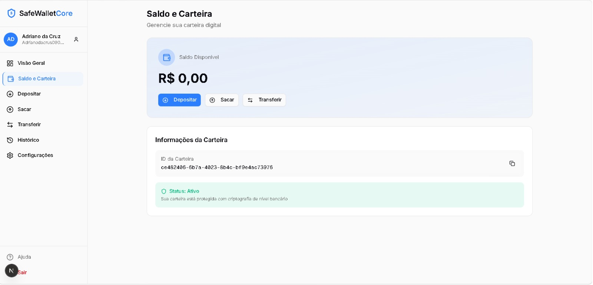

### 6️⃣ A Interface de Transações: Depositando
Para alimentar a conta recém-criada, o usuário usa o menu de depósitos. A requisição passa novamente pela *eclusa perimetral* de segurança e entra numa operação de banco de dados **ACID** (através da anotação `@Transactional` no Spring).

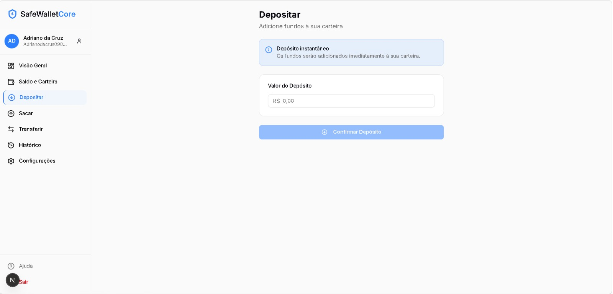

Ao confirmar a transação, o sistema realiza a operação. Se algo falhasse, o Spring aplicaria o *rollback* automático. Sendo bem-sucedido, ele persiste na tabela de forma atômica.

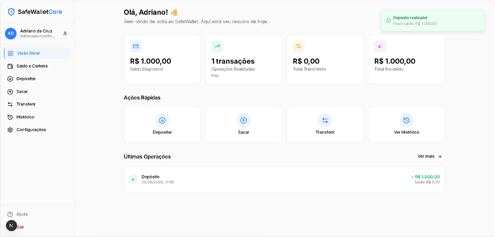

Logo em seguida, a carteira do usuário reflete instantaneamente o saldo abastecido, lido com segurança da base de dados.

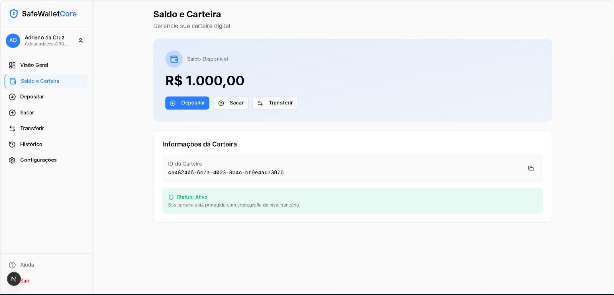

### 7️⃣ Outras Operações: O Saque
Assim como o depósito, o usuário tem à disposição o menu de Saque para liquidar recursos, também protegido pelo filtro JWT.

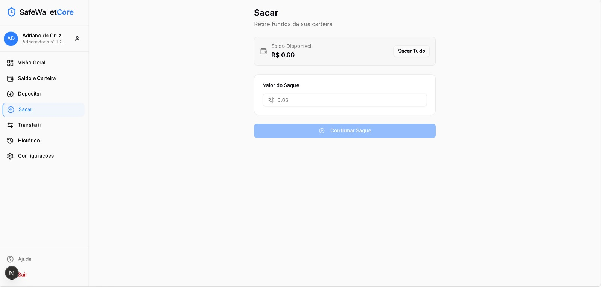

Se o usuário executar um saque e o backend validar o saldo via regra de negócio rigorosa, a dedução é processada de imediato, e a resposta blindada de erros críticos é devolvida ao React.

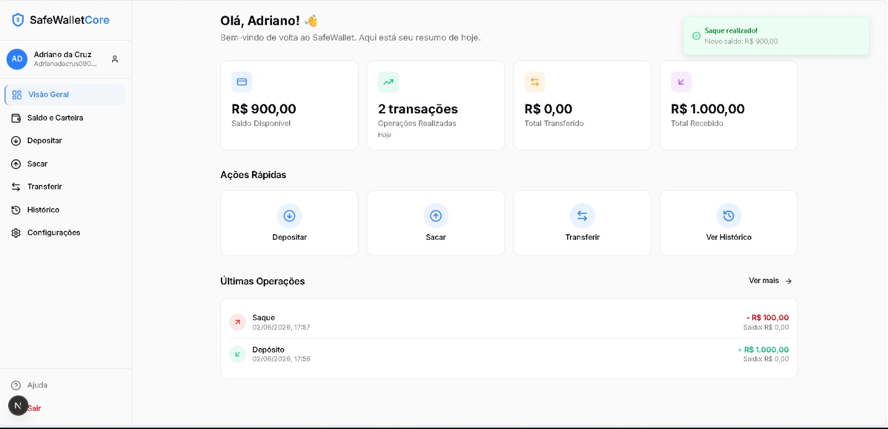

### 8️⃣ Interação P2P: O Usuário 2 entra em cena
Enquanto isso, a conta do Usuário 2 foi criada e acessada. Ele nota que sua carteira está completamente isolada e vazia, pronta para receber fundos. A arquitetura de segurança do Spring garante que o perímetro deste usuário seja estritamente isolado do primeiro.

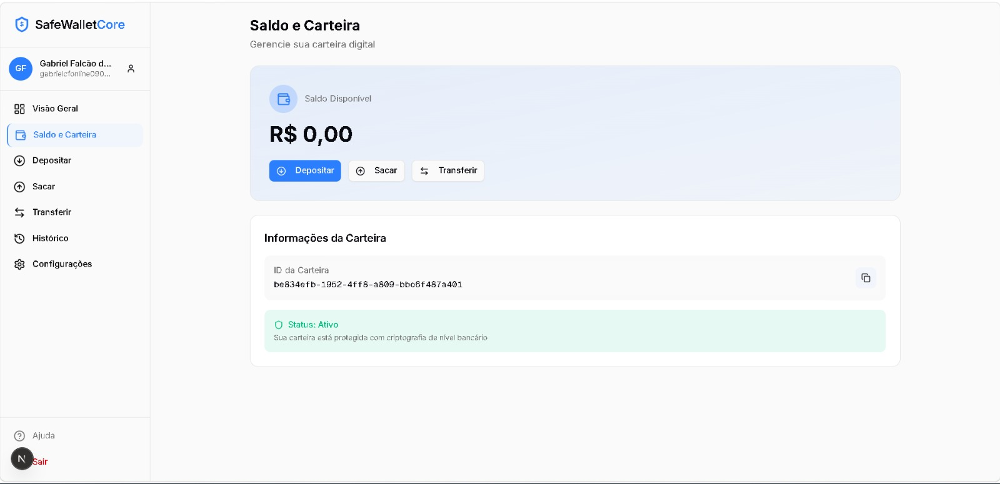

### 9️⃣ Orquestrando uma Transferência
Com a necessidade de transferir valores para o Usuário 2, o Usuário 1 acessa o painel de transferência. Informa o Wallet ID do destinatário e o valor desejado.

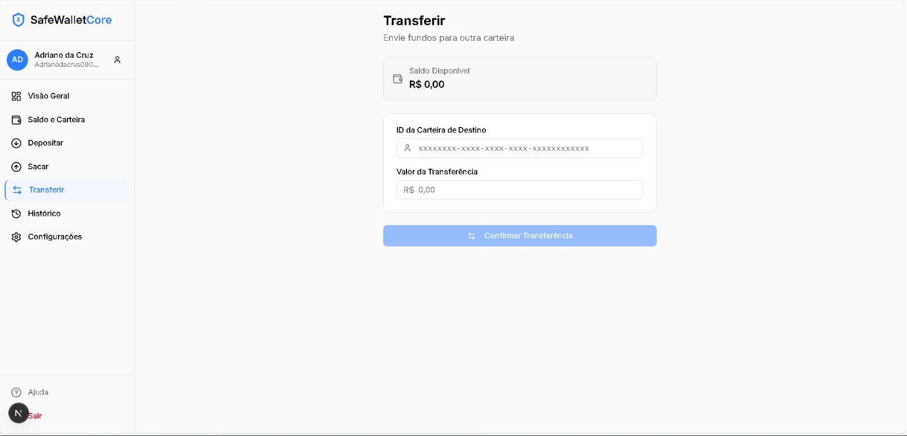

Ele preenche e envia o formulário. Neste momento, o Java abre uma única **transação atômica** para debitar do Usuário 1 e creditar no Usuário 2.

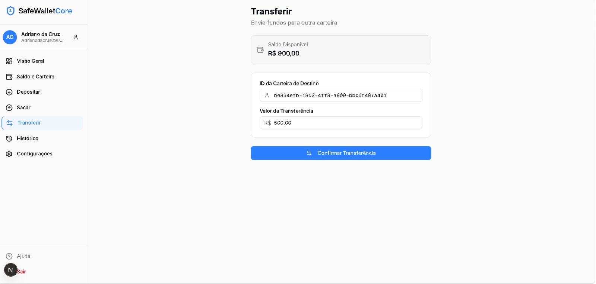

A confirmação instantânea é apresentada na tela. O valor saiu de sua carteira e foi injetado na conta do destino sem risco de concorrência suja!

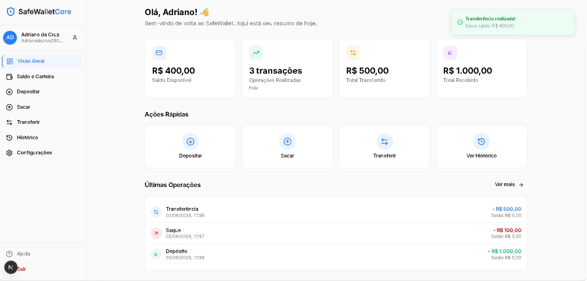

### 🔟 A Chegada do Dinheiro
Imediatamente, ao visualizar o seu próprio painel (acessado com seu próprio JWT seguro), o Usuário 2 constata o aumento em seu saldo após receber os recursos do Usuário 1.

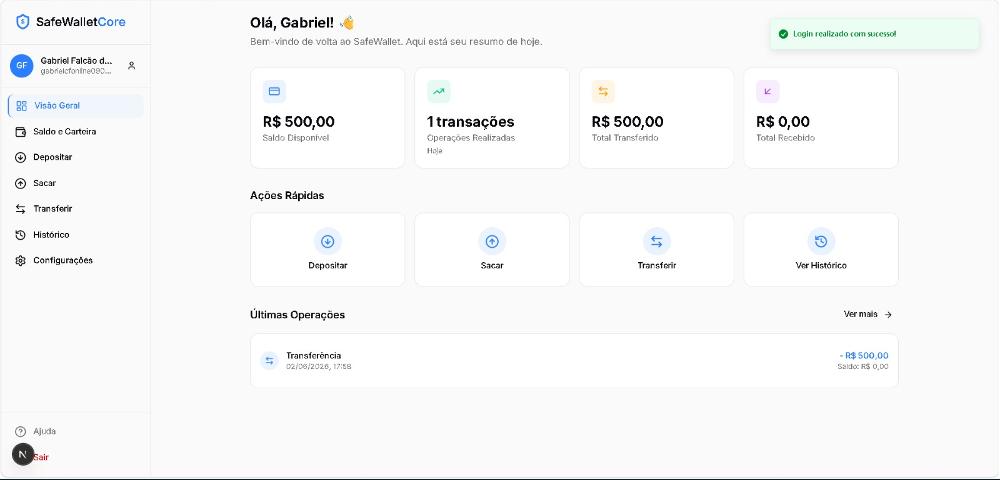

### 1️⃣1️⃣ Transparência e Rastreabilidade
Cada movimentação no ecossistema fica gravada no histórico de transações. Os endpoints de histórico são totalmente fechados, permitindo que cada pessoa veja apenas as movimentações atreladas à sua própria assinatura criptográfica.

Na tela principal do histórico, listamos as transações em formato de tabela.

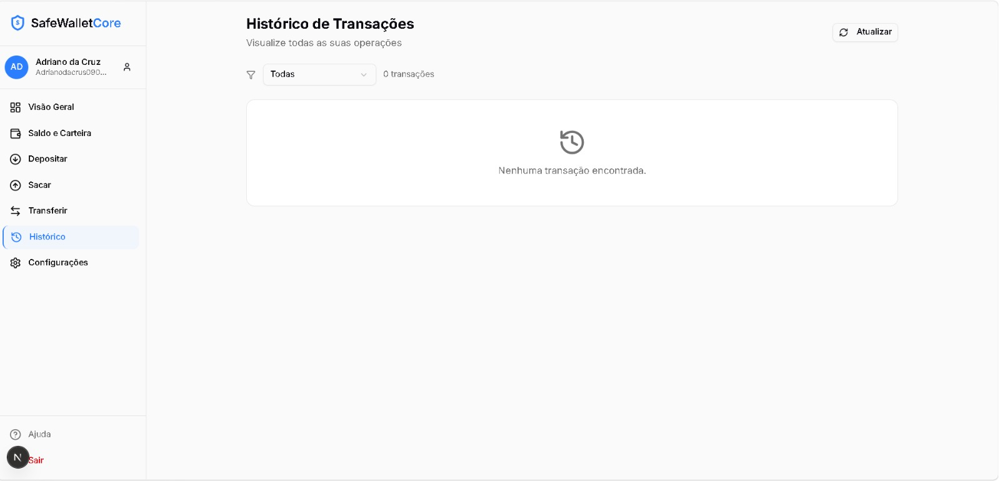

Visão do histórico do Usuário 1, com saídas (transferências e saques) e entradas (depósitos).

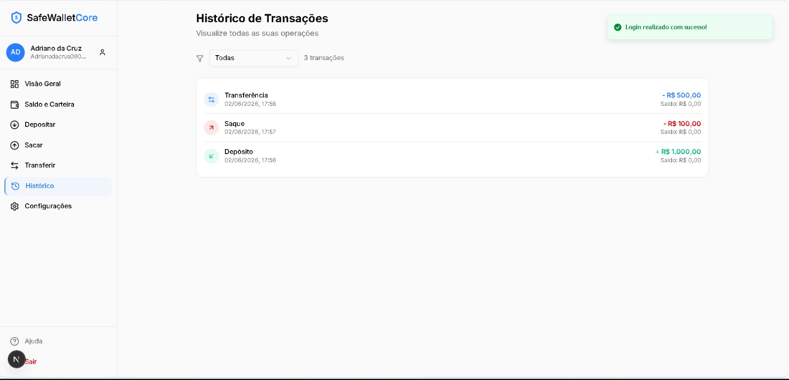

Visão do histórico do Usuário 2, atestando o recebimento da transferência.

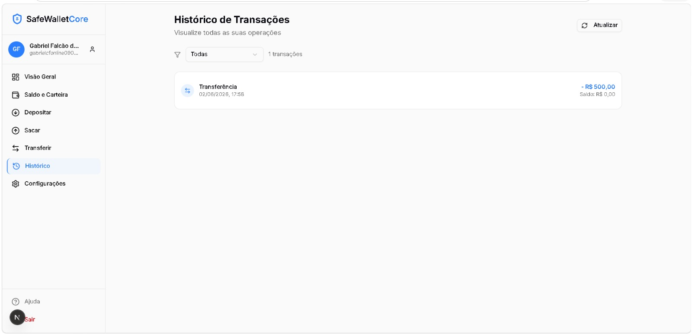

### 1️⃣2️⃣ Finalizando o Expediente
O sistema dispõe de uma tela de Configurações onde o usuário pode administrar seu perfil e revogar sua sessão no lado do cliente, removendo o JWT do *storage* local e desativando acessos.

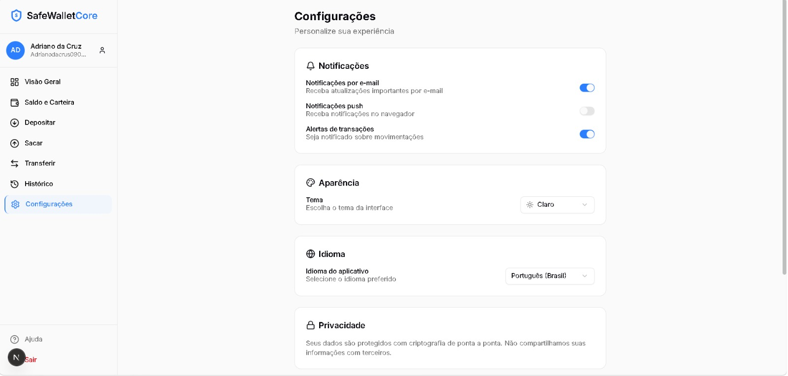

---

## 🚀 Como Executar o Ecossistema Localmente

### Pré-requisitos
- Java 21 SDK instalado
- Apache Maven configurado
- Docker & Docker Compose ativos
- Node.js e pnpm instalados

### Estrutura do Repositório
```text
safewallet/
├── backend/                  # Microsserviço Spring Boot (API REST Core)
│   ├── src/
│   ├── pom.xml
│   └── mvnw
├── frontend/                 # Interface do usuário em React
│   ├── src/
│   ├── package.json
│   └── ...
├── docker-compose.yaml       # Orquestração do PostgreSQL local
└── README.md
```

### Passo a Passo de Inicialização

1. **Clone o repositório e navegue até a raiz:**
   ```bash
   git clone https://github.com/GabrielF0900/safewallet-core.git
   cd safewallet
   ```

2. **Inicialize o Banco de Dados PostgreSQL via Docker Compose:**
   ```bash
   docker-compose up -d
   ```

3. **Compile e execute o Back-end (Spring Boot):**
   *É obrigatório entrar na subpasta onde reside o arquivo pom.xml para o correto gerenciamento do cache da JVM:*
   ```bash
   cd backend
   mvn clean compile spring-boot:run
   ```
   A API inicializará e estará pronta para escutar tráfego na porta padrão `http://localhost:8080`.

4. **Inicialize a Interface Front-end (React):**
   Em um novo terminal na raiz do projeto:
   ```bash
   cd frontend
   pnpm install
   pnpm run dev
   ```
   O painel web estará acessível em `http://localhost:5173` ou na porta disponibilizada pelo Vite/Next.

---

## 📝 Contratos Principais da API (EndPoints)

### Autenticação Perimetral (`/api/auth`)

#### 🔹 `POST /api/auth/register` — Cadastrar Novo Cliente
**Acesso:** Público (`.permitAll()`)
- **Payload de Entrada (JSON):**
  ```json
  {
    "name": "Gabriel Falcão",
    "email": "gabriel.falcao@safewallet.com",
    "password": "SenhaForte@2026"
  }
  ```
- **Payload de Resposta (`201 Created`):**
  ```json
  {
    "id": "a4a1305d-4675-4201-8486-3ef646a61e99",
    "name": "Gabriel Falcão",
    "email": "gabriel.falcao@safewallet.com"
  }
  ```

#### 🔹 `POST /api/auth/login` — Efetuar Login Autenticado
**Acesso:** Público (`.permitAll()`)
- **Payload de Entrada (JSON):**
  ```json
  {
    "email": "gabriel.falcao@safewallet.com",
    "password": "SenhaForte@2026"
  }
  ```
- **Payload de Resposta Envelopado (`200 OK`):**
  ```json
  {
    "message": "Login efetuado com sucesso!",
    "token": "eyJhbGciOiJIUzI1NiIsInR5cCI6IkpXVCJ9.eyJzdWIiOiJhNGExMzA1ZC...[JWT Tuncated]",
    "name": "Gabriel Falcão"
  }
  ```

---

## ☁️ Hospedagem e Infraestrutura AWS (Cloud Architecture)

O ecossistema **SafeWallet Core** encontra-se em fase de modelagem de infraestrutura *Cloud-Native*. A arquitetura AWS está atualmente sendo desenhada e preparada (via Terraform e serviços como ECS Fargate, RDS e CloudFront) para que todo o sistema, de ponta a ponta, seja hospedado em breve na Amazon Web Services (AWS) com altíssima disponibilidade e segurança de nível bancário.

---

## 📄 Licença
Projeto desenvolvido estritamente para fins educacionais, de portfólio técnico e autodesenvolvimento em arquitetura de sistemas críticos.

---
**Desenvolvido com ❤️ por Gabriel Falcão | 2026**