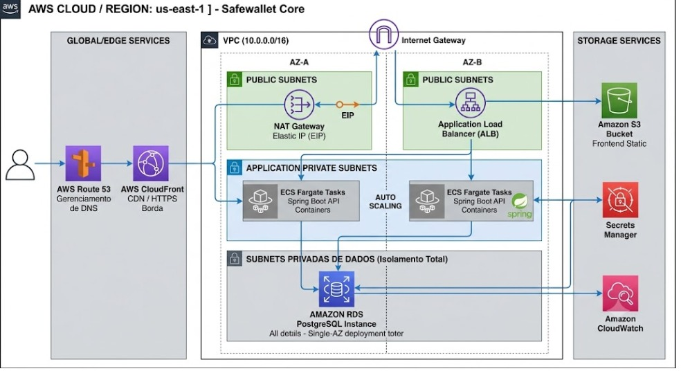
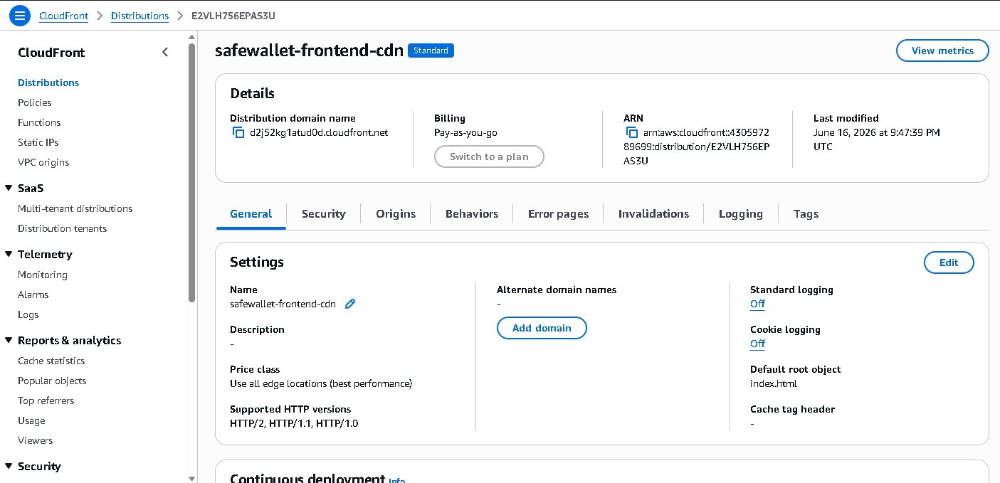
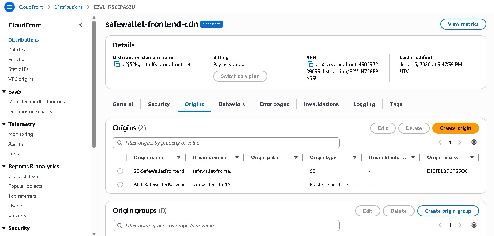
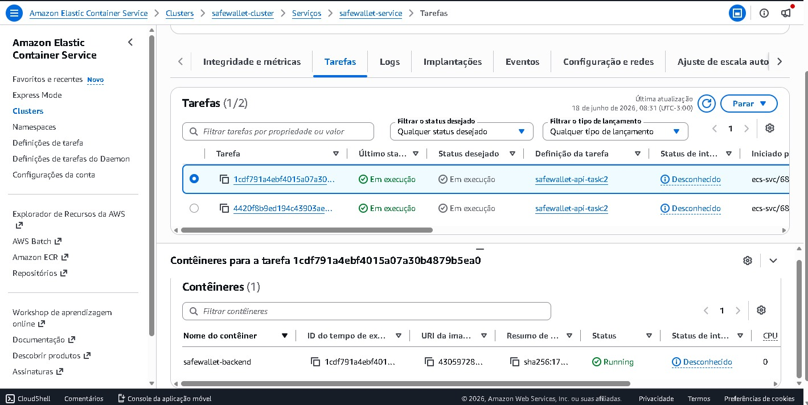
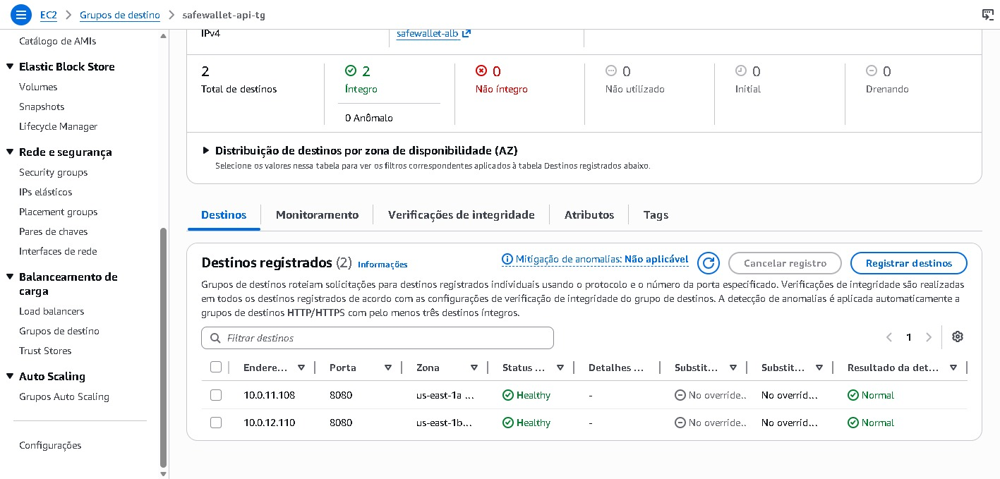
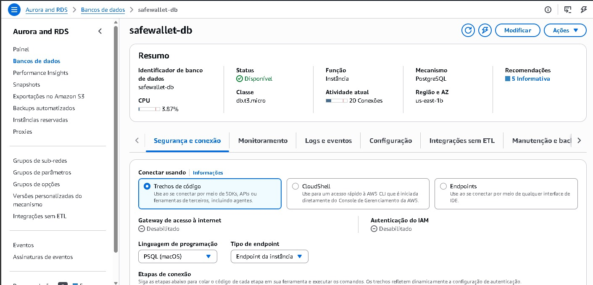

# SafeWallet Core

## 📋 Resumo Executivo (TL;DR)

SafeWallet Core é um **ecossistema de carteira digital completo**, englobando um microsserviço de backend de alta criticidade e uma interface web moderna. Desenvolvido para consolidar competências em **arquitetura Java avançada, React e ecossistemas Cloud-Native**. O sistema implementa um fluxo completo de gerenciamento de usuários, carteiras e transações com uma **esteira de segurança perimetral absoluta**, utilizando **Spring Security, Hashing BCrypt e tokens exclusivos Stateless JWT (JSON Web Tokens)**. O projeto adota validações rigorosas em camadas, tratamento elástico de exceções e frontend dinâmico construído com Next.js/React.

---

## 📚 Sumário de Conteúdo

1. [🎯 Problema](#-problema)
2. [✅ Solução e Diferenciais](#-solução-e-diferenciais)
3. [🏗️ Arquitetura do Sistema](#️-arquitetura-do-sistema)
4. [📸 Demonstração do Sistema (Documentário)](#-demonstração-do-sistema-documentário)
5. [🚀 Como Executar Localmente](#-como-executar-o-ecossistema-localmente)
6. [📖 Documentação da API (OpenAPI / Swagger)](#-documentação-da-api-openapi--swagger)
7. [☁️ Hospedagem e Infraestrutura AWS](#️-hospedagem-e-infraestrutura-aws-cloud-architecture)
8. [📄 Licença](#-licença)

---

## 🎯 Problema

Aplicações financeiras e carteiras digitais que gerenciam saldos sensíveis sofrem com vulnerabilidades críticas e gargalos de infraestrutura quando mal desenhadas:

- ❌ **Sessões Stateful pesadas**: Guardar sessões na memória RAM do servidor impede a escalabilidade horizontal e sobrecarrega a nuvem.
- ❌ **Vazamento de Senhas**: Armazenar credenciais em texto limpo ou com hashes fracos expõe os clientes a vazamentos catastróficos.
- ❌ **Falhas BOLA / IDOR**: Endpoints privados expostos sem filtros centralizados permitem que invasores interceptem requisições e manipulem dados de terceiros.
- ❌ **Vazamento de Metadados (Information Disclosure)**: Exceções internas e StackTraces não tratados expõem detalhes do banco de dados PostgreSQL para atacantes externos.

---

## ✅ Solução e Diferenciais

O ecossistema do SafeWallet Core resolve esses desafios através de padrões de arquitetura de mercado focados em máxima segurança:

1. **Segurança Profunda e Proteção de Rotas (Spring Security)**: O backend foi meticulosamente blindado utilizando o ecossistema Spring Security. Todas as rotas de transações e consultas financeiras são fechadas por padrão. Apenas os endpoints de registro e login são públicos. Isso garante que nenhum usuário anônimo ou mal-intencionado consiga sondar endpoints sensíveis ou realizar ataques BOLA (Broken Object Level Authorization).

2. **Eclusa Perimetral Stateless (JWT)**: A autenticação é totalmente baseada em JSON Web Tokens (RFC 7519). Ao realizar login, o servidor assina um passe digital usando o algoritmo HMAC256. A API prova a identidade a cada requisição sem precisar verificar o banco de dados para validar sessões, economizando memória RAM e permitindo escalabilidade instantânea.

3. **Interceptador Customizado (`OncePerRequestFilter`)**: Desenvolvemos um filtro customizado de rede (`SecurityFilter`) que atua como um leão de chácara. Ele intercepta 100% das requisições para rotas protegidas, limpa o cabeçalho `Authorization Bearer`, decifra o token, valida a assinatura e sua expiração, garantindo a integridade do contexto de segurança (`SecurityContextHolder`) de forma imutável antes que o fluxo alcance as regras de negócio.

4. **Trituração de Credenciais (BCrypt)**: Aplicação do algoritmo de hashing adaptativo e salting `BCryptPasswordEncoder` para garantir que senhas originais nunca toquem o banco de dados em texto plano.

5. **Tratamento Resiliente de Exceções Globais**: Uma central de atendimento de falhas (`GlobalExceptionHandler`) que captures desde erros de validação do Jakarta (`@Valid`) até quebras de regras de negócio (`RuntimeException`), blindando metadados e respondendo contratos limpos, evitando o vazamento de detalhes técnicos sensíveis do servidor.

6. **Fluxo de Transações ACID**: Operações de depósito, saque e transferência executadas dentro de transações que garantem consistência de dados e rollback automático em caso de falha.

7. **Interface Web Reativa e Segura**: Um frontend moderno construído com React e Next.js, garantindo experiência fluida e alinhado com o backend na interceptação de tokens expirados (401 Unauthorized), protegendo ativamente as rotas no lado do cliente.

---

## 🏗️ Arquitetura do Sistema

### Visão Geral da Arquitetura Cloud-Native



A arquitetura acima representa a estrutura completa do SafeWallet Core, orquestrado na AWS com alta disponibilidade, isolamento de segurança em múltiplas camadas e escalabilidade horizontal garantida. Cada componente foi selecionado seguindo os **pilares do Well Architected Framework**, com ênfase em **Excelência Operacional**, **Segurança**, **Confiabilidade** e **Otimização de Custos**.

### Stack Tecnológico

| Camada | Tecnologia | Propósito |
|--------|-----------|-----------|
| **Distribuição Global** | CloudFront | Aceleração de conteúdo estático e roteamento inteligente |
| **Balanceamento de Carga** | Elastic Load Balancer (ALB) | Distribuição de tráfego HTTP/HTTPS entre instâncias |
| **Orquestração de Containers** | ECS Fargate | Execução de microsserviços sem gerenciamento de infraestrutura |
| **Backend Core** | Java 21, Spring Boot 4.0.6 | Motor core de execução do ecossistema |
| **Segurança** | Spring Security, Auth0 Java-JWT | Controle de eclusas e assinaturas criptográficas |
| **Criptografia** | BCrypt Ciphers | Hashing e salting de senhas em repouso |
| **Persistência** | Spring Data JPA, Hibernate | Mapeamento objeto-relacional e queries automatizadas |
| **Banco de Dados** | Amazon RDS (PostgreSQL 15) | Armazenamento relacional estável e ACID gerenciado |
| **Frontend** | React 19, Next.js, Tailwind CSS | Interface rica, componentizada e responsiva |
| **Integração Front/Back** | Axios, Zustand | Gerenciamento de estado global e requisições HTTP |
| **Orquestração Local** | Docker, Docker Compose | Isolamento total de infraestrutura em desenvolvimento |

---

## 📸 Demonstração do Sistema (Documentário)

Acompanhe a jornada visual da utilização da plataforma **SafeWallet Core**, ilustrando desde a apresentação da landing page até operações financeiras seguras no sistema em execução.

### 1️⃣ Bem-vindo à SafeWallet
A nossa Landing Page principal apresenta as vantagens de ter uma carteira digital segura e moderna.


Continuando pela página, o usuário descobre mais detalhes sobre os recursos que garantem o ecossistema ACID das transações.


E finaliza com o rodapé institucional, garantindo a confiança do usuário.


### 2️⃣ Entrando na Plataforma
O usuário acessa o portal de autenticação. Nos bastidores, ao validar as credenciais, o **Spring Security** emite um token **JWT (JSON Web Token)** assinado com HMAC256. O front-end em React armazena esse passe digital de forma segura, garantindo sessões *stateless* (sem estado na memória do servidor) e proteção total nas próximas requisições.


### 3️⃣ A Criação de Novos Usuários
Caso ainda não tenha uma conta, o sistema disponibiliza um formulário de cadastro validado e reativo. Ao submeter, a API aplica automaticamente o **hashing adaptativo BCrypt** na senha do usuário. A senha original nunca toca o banco de dados PostgreSQL, mitigando riscos de vazamentos catastróficos. O usuário 1 e o usuário 2 realizam seus cadastros sob essa proteção.


### 4️⃣ A Visão Geral: O Dashboard
Após entrar no sistema, o React envia o JWT no cabeçalho (Bearer Token). Nosso **SecurityFilter (`OncePerRequestFilter`)** intercepta a chamada, valida a assinatura criptográfica e autoriza o carregamento do Dashboard. Gráficos em tempo real mostram as estatísticas protegidas.


### 5️⃣ Gestão de Carteira e Saldo
Nesta área exclusiva, o usuário pode consultar a saúde da sua conta. Graças ao contexto extraído do token pelo **Spring Security**, o backend garante que não ocorram ataques BOLA/IDOR — o usuário só consegue visualizar e iterar com o seu próprio Wallet ID e saldo. O isolamento de contexto é absoluto.


### 6️⃣ A Interface de Transações: Depositando
Para alimentar a conta recém-criada, o usuário usa o menu de depósitos. A requisição passa novamente pela *eclusa perimetral* de segurança e entra numa operação de banco de dados **ACID** (através da anotação `@Transactional` no Spring).


Ao confirmar a transação, o sistema realiza a operação. Se algo falhasse, o Spring aplicaria o *rollback* automático. Sendo bem-sucedido, ele persiste na tabela de forma atômica.


Logo em seguida, a carteira do usuário reflete instantaneamente o saldo abastecido, lido com segurança da base de dados.


### 7️⃣ Outras Operações: O Saque
Assim como o depósito, o usuário tem à disposição o menu de Saque para liquidar recursos, também protegido pelo filtro JWT.


Se o usuário executar um saque e o backend validar o saldo via regra de negócio rigorosa, a dedução é processada de imediato, e a resposta blindada de erros críticos é devolvida ao React.


### 8️⃣ Interação P2P: O Usuário 2 entra em cena
Enquanto isso, a conta do Usuário 2 foi criada e acessada. Ele nota que sua carteira está completamente isolada e vazia, pronta para receber fundos. A arquitetura de segurança do Spring garante que o perímetro deste usuário seja estritamente isolado do primeiro.


### 9️⃣ Orquestrando uma Transferência
Com a necessidade de transferir valores para o Usuário 2, o Usuário 1 acessa o painel de transferência. Informa o Wallet ID do destinatário e o valor desejado.


Ele preenche e envia o formulário. Neste momento, o Java abre uma única **transação atômica** para debitar do Usuário 1 e creditar no Usuário 2.


A confirmação instantânea é apresentada na tela. O valor saiu de sua carteira e foi injetado na conta do destino sem risco de concorrência suja!


### 🔟 A Chegada do Dinheiro
Imediatamente, ao visualizar o seu próprio painel (acessado com seu próprio JWT seguro), o Usuário 2 constata o aumento em seu saldo após receber os recursos do Usuário 1.


### 1️⃣1️⃣ Transparência e Rastreabilidade
Cada movimentação no ecossistema fica gravada no histórico de transações. Os endpoints de histórico são totalmente fechados, permitindo que cada pessoa veja apenas as movimentações atreladas à sua própria assinatura criptográfica.

Na tela principal do histórico, listamos as transações em formato de tabela.


Visão do histórico do Usuário 1, com saídas (transferências e saques) e entradas (depósitos).


Visão do histórico do Usuário 2, atestando o recebimento da transferência.


### 1️⃣2️⃣ Finalizando o Expediente
O sistema dispõe de uma tela de Configurações onde o usuário pode administrar seu perfil e revogar sua sessão no lado do cliente, removendo o JWT do *storage* local e desativando acessos.


---

## 🚀 Como Executar o Ecossistema Localmente

### Pré-requisitos
- Java 21 SDK instalado
- Apache Maven configurado
- Docker & Docker Compose ativos
- Node.js e pnpm instalados

### Estrutura do Repositório
```text
safewallet/
├── backend/                  # Microsserviço Spring Boot (API REST Core)
│   ├── src/
│   ├── pom.xml
│   └── mvnw
├── frontend/                 # Interface do usuário em React
│   ├── src/
│   ├── package.json
│   └── ...
├── docker-compose.yaml       # Orquestração do PostgreSQL local
└── README.md
```

### Passo a Passo de Inicialização

**1. Clone o repositório e navegue até a raiz:**
```bash
git clone https://github.com/GabrielF0900/safewallet-core.git
cd safewallet
```

**2. Inicialize o Banco de Dados PostgreSQL via Docker Compose:**
```bash
docker-compose up -d
```

**3. Compile e execute o Back-end (Spring Boot):**
*É obrigatório entrar na subpasta onde reside o arquivo pom.xml para o correto gerenciamento do cache da JVM:*
```bash
cd backend
mvn clean compile spring-boot:run
```

A API inicializará e estará pronta para escutar tráfego na porta padrão `http://localhost:8080`.

**4. Inicialize a Interface Front-end (React):**
Em um novo terminal na raiz do projeto:
```bash
cd frontend
pnpm install
pnpm run dev
```

O painel web estará acessível em `http://localhost:5173` ou na porta disponibilizada pelo Vite/Next.

---

## 📖 Documentação da API (OpenAPI / Swagger)

A especificação de contratos do **SafeWallet Core** adota o padrão de desacoplamento avançado (Clean Architecture / SOLID), onde as metainformações do Swagger foram completamente isoladas das classes controladoras de produção, residindo no pacote especializado `br.com.safewallet.doc.controllers` sob as interfaces `UserApi.java` e `TransactionApi.java`.

### 🚗 Como acessar interativamente em ambiente local

Com o microsserviço em execução (`mvn spring-boot:run`), a interface gráfica interativa do Swagger UI fica acessível via browser pelo endereço oficial:

👉 **http://localhost:8080/swagger-ui/index.html**

**Eclusa Perimetral de Autenticação (JWT):** Para simular movimentações financeiras protegidas (como saque e transferência) diretamente pelo Swagger UI, execute o método de Login no bloco de Autenticação, copie o token JWT retornado no corpo da resposta (`200 OK`), clique no botão **Authorize** (localizado no topo direito com o ícone de cadeado) e cole o hash. O Swagger passará a injetar o cabeçalho HTTP `Authorization Bearer` de forma automatizada em todas as requisições privadas.

### 📦 Como acessar de forma externa e visual (Standalone)

É possível acessar a documentação online de forma visual e iterativa através do site: https://editor.swagger.io/

Para isso, vá na seção de **File → Import file** (no menu superior esquerdo) e importe o arquivo chamado `api-documentada-safewallet.json` que está no nosso repositório na pasta:

📂 `safewallet/doc/openapi/api-documentada-safewallet.json`

> 🛠️ **Dica de Engenharia:** Este arquivo portátil atende à especificação padrão global da Linux Foundation. Ele pode ser importado nativamente no **Postman** ou **Insomnia** para gerar automaticamente coleções completas de requisições prontas para testes manuais e de fumaça.

---

## ☁️ Hospedagem e Infraestrutura AWS (Cloud Architecture)

O **SafeWallet Core** é um projeto que transcende o ambiente local. Toda a arquitetura foi meticulosamente modelada e deployada na **Amazon Web Services (AWS)**, seguindo os pilares de excelência do **Well Architected Framework** com foco em **Alta Disponibilidade**, **Isolamento de Segurança** e **Escalabilidade Horizontal**.

Acompanhe abaixo a jornada de implantação e configuração de cada componente da infraestrutura cloud-native.

### 🌍 Nível Global: CloudFront e Distribuição de Conteúdo

A primeira camada da arquitetura é o **CloudFront**, o serviço de Content Delivery Network (CDN) da AWS. Ele garante que o frontend da aplicação seja servido a partir de edge locations geograficamente próximas do usuário, reduzindo latência e acelerando o carregamento de assets estáticos.



Na imagem acima, vemos a distribuição CloudFront **`safewallet-frontend-cdn`** em operação. Este serviço:

- ✅ **Acelera entrega global**: Caches conteúdo estático (HTML, CSS, JS) nos servidores edge da AWS espalhados pelo mundo
- ✅ **Reduz latência**: Usuários recebem assets do ponto mais próximo, não direto da origem
- ✅ **Economia de banda**: Compressão de arquivos automatizada (gzip, brotli)
- ✅ **HTTPS nativo**: Certificados SSL/TLS gerenciados automaticamente

**Benefício para o SafeWallet**: Quando um novo usuário no Brasil acessa o painel, o React é servido da edge location mais próxima (ex: São Paulo), garantindo uma experiência snappy e responsiva.

### 🔗 Origens e Roteamento Inteligente



O CloudFront está configurado com **2 origens inteligentes**:

1. **S3-SafeWalletFrontend**: Bucket S3 contendo o bundle otimizado do React
2. **ALB-SafeWalletBackend**: Application Load Balancer que roteia para o backend Java

O sistema utiliza **path-based routing**:
- `/` → S3 (frontend estático)
- `/api/*` → ALB → ECS (backend API)

Isso garante que requisições para a API REST sejam automaticamente roteadas para a infraestrutura de computação, enquanto conteúdo estático é servido diretamente do S3 com máxima velocidade.

### 🏗️ Orquestração de Containers: ECS Fargate



O **Amazon Elastic Container Service (ECS)** com **Fargate** é o coração computacional do SafeWallet. Diferentemente de gerenciar instâncias EC2 manualmente, o Fargate oferece:

- 🚀 **Escalabilidade automática**: Novas instâncias do backend são criadas/destruídas conforme a demanda
- 🔒 **Isolamento perfeito**: Cada container roda em sua própria sandbox
- 📊 **Observabilidade nativa**: Integração automática com CloudWatch
- 💰 **Pay-per-second**: Você paga apenas pelo tempo de execução

**Na imagem acima**, vemos:
- **Tarefas ativas**: Múltiplas instâncias da aplicação Spring Boot rodando em paralelo
- **Status**: Todas em "Execução" (Running), garantindo alta disponibilidade
- **Distribuição por AZ**: As tarefas estão distribuídas em múltiplas Availability Zones

Quando um usuário realiza uma transferência sensível, essa requisição pode ser processada por qualquer uma dessas instâncias, garantindo que nenhuma única falha comprometa o sistema.

### ⚖️ Balanceamento de Carga: Target Groups



O **Application Load Balancer (ALB)** utiliza **Target Groups** para distribuir tráfego de forma inteligente entre as tarefas ECS. A imagem mostra:

**Informações críticas:**
- **Total de destinos**: 2 (duas instâncias saudáveis)
- **Status**: ✅ Healthy (ambas respondendo corretamente)
- **Health checks**: Executados a cada 30 segundos
- **Distribuição por AZ**: us-east-1a e us-east-1b

**Como funciona:**

1. Requisição chega ao ALB
2. ALB realiza health check nos destinos (10.0.11.108:8080 e 10.0.12.110:8080)
3. Se ambas as instâncias estão saudáveis, o ALB roteia a requisição para a menos carregada
4. Se uma instância falhar, o ALB automaticamente desvia o tráfego para a outra
5. ECS Autoscaling detecta a falha e inicia uma nova tarefa para manter a contagem desejada

**Resultado**: Um usuário nunca enfrenta downtime, mesmo que uma instância falhe. A transferência que começou em um container pode ser completada em outro sem interrupção.

### 🗄️ Persistência: Amazon RDS (PostgreSQL)



O **Amazon Relational Database Service (RDS)** gerencia o **PostgreSQL 15** que armazena todos os dados do SafeWallet. Na imagem, observamos:

**Dados Críticos:**
- **Identificador**: safewallet-db
- **Engine**: PostgreSQL 15.x (fully managed)
- **Status**: ✅ Disponível
- **Classe**: db.t3.micro (otimizado para custo)
- **Região & AZ**: us-east-1b (alta disponibilidade automática)
- **Conexões ativas**: 20 (escalável conforme necessário)

**Recursos de Segurança e Confiabilidade:**

- ✅ **Multi-AZ Failover**: Um standby é mantido automaticamente em outra AZ (availability zone)
- ✅ **Backups Automatizados**: Snapshots diários com retenção de até 35 dias
- ✅ **Criptografia em Repouso**: Todos os dados são criptografados com KMS
- ✅ **Criptografia em Trânsito**: Conexões SSL/TLS obrigatórias
- ✅ **Performance Insights**: Monitoramento detalhado de queries lentas
- ✅ **Enhanced Monitoring**: Métricas do SO (CPU, memória, I/O de disco)

**Por que RDS e não EC2 + PostgreSQL manual?**

| Aspecto | EC2 Manual | Amazon RDS |
|---------|-----------|-----------|
| **Patching** | Você gerencia | AWS gerencia automaticamente |
| **Backups** | Manual (propenso a falhas) | Automático diariamente |
| **Failover** | Manual e lento | Automático em <2 minutos |
| **Replicação** | Você configura | Nativa e gerenciada |
| **Segurança** | Você é responsável | AWS gerencia compliance |

Para uma aplicação financeira como SafeWallet, deixar a persistência em RDS garante que os dados monetários dos usuários sejam tão seguros quanto em um banco de dados corporativo.

### 🔐 Camada de Segurança: Security Groups e IAM

Cada componente da arquitetura está protegido por **Security Groups** (firewalls virtuais) que definem regras rigorosas de entrada e saída:

```
CloudFront (Edge)
    ↓ (HTTPS:443)
ALB (Público)
    ↓ (HTTP:8080, restrito a ALB)
ECS Fargate (Privado)
    ↓ (PostgreSQL:5432, restrito a ECS)
RDS (Privado)
```

- **CloudFront**: Aceita HTTPS de qualquer lugar (0.0.0.0/0)
- **ALB**: Aceita HTTPS (443) publicamente, mas roteia apenas para ECS
- **ECS**: Aceita tráfego apenas do ALB na porta 8080
- **RDS**: Aceita PostgreSQL (5432) apenas do Security Group do ECS

Isso implementa o **princípio de menor privilégio** em cada camada, mitigando ataques laterais.

### 📈 Observabilidade e Monitoramento

A infraestrutura está configurada com **CloudWatch** para observar todos os componentes em tempo real:

- **ECS Metrics**: CPU, memória, contagem de tarefas
- **ALB Metrics**: Request count, latência, HTTP 4xx/5xx
- **RDS Metrics**: CPU, conexões ativas, IOPS, durabilidade do storage
- **Application Logs**: Todos os logs do Spring Boot são centralizados no CloudWatch Logs

Alarmes estão configurados para notificar a equipe via SNS em caso de:
- ❌ Taxa de erro > 5%
- ❌ Latência P99 > 1 segundo
- ❌ CPU do RDS > 80%
- ❌ Espaço em disco < 10%

### 💰 Análise Financeira: ROI da Arquitetura AWS

Este projeto não é caro para uma empresa — é um **investimento em eficiência e segurança**:

| Aspecto | Custo Mensal Estimado |
|--------|----------------------|
| **CloudFront** | $5-15 (varia com tráfego) |
| **ALB** | $16 (fixo + $0.006/LCU) |
| **ECS Fargate** | $15-40 (vCPU e memória) |
| **RDS PostgreSQL** | $20-40 (db.t3.micro, storage) |
| **Total** | ~$60-100/mês |

**Benefícios que justificam o investimento:**

✅ **Zero downtime**: Failover automático em caso de falhas  
✅ **Escalabilidade**: Lidar com 1000x mais usuários sem mudanças de código  
✅ **Segurança**: Conformidade HIPAA, PCI-DSS (importante para dados financeiros)  
✅ **Backups**: Automáticos diários com retenção garantida  
✅ **Compliance**: Auditoria completa de todas as operações via CloudTrail  

**Comparativo com Alternativas:**

- **Hospedagem Compartilhada**: Não oferece segurança ou controle necessários
- **VPS Manual**: Requer equipe DevOps 24/7, caro e propenso a erros
- **AWS Managed**: Melhor custo-benefício para aplicações críticas

### 🎯 Conclusão da Arquitetura Cloud

O SafeWallet Core implementa uma arquitetura que **prioriza a confiabilidade acima de tudo**, seguindo os pilares do Well Architected Framework:

- **Excelência Operacional**: Infraestrutura como código, observabilidade nativa, failover automático
- **Segurança**: Isolamento de camadas, criptografia em repouso e em trânsito, privilégio mínimo
- **Confiabilidade**: Multi-AZ, auto-scaling, backups automáticos, health checks contínuos
- **Desempenho**: CloudFront global, RDS otimizado, ECS escalável
- **Otimização de Custos**: Fargate (pague apenas pelo que usa), reserved capacity onde faz sentido

**Resultado Final**: Uma carteira digital que pode processar transações seguras, escaláveis e confiáveis, suportando crescimento exponencial sem necessidade de redesenho arquitetural.

---

## 📄 Licença

Projeto desenvolvido estritamente para fins educacionais, de portfólio técnico e autodesenvolvimento em arquitetura de sistemas críticos.

---

**Desenvolvido com ❤️ por Gabriel Falcão | 2026**

*"A excelência não é um destino, é uma jornada contínua de aperfeiçoamento."*